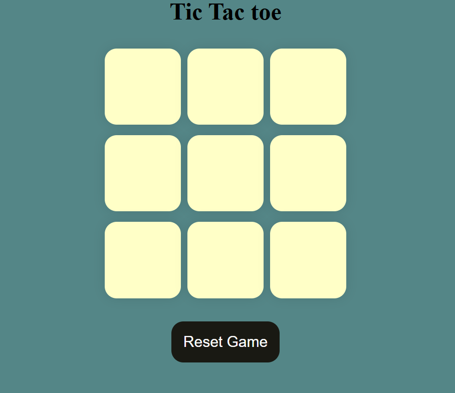
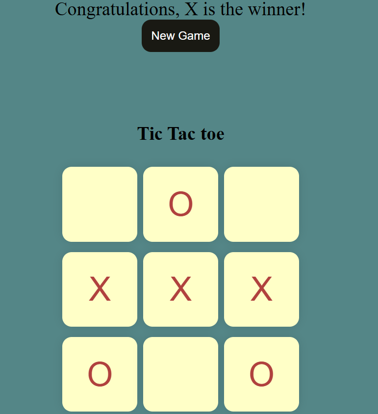

# Tic-Tac-Toe
🎮 Tic-Tac-Toe Game
A simple and interactive Tic-Tac-Toe game built using HTML, CSS, and JavaScript. This web-based version lets two players take turns marking "X" and "O" on a 3×3 grid and determines the winner automatically.

📁 Project Structure
    tic-tac-toe/ 
    ├── index.html  # Main HTML layout 
    ├── style.css   # Styles for layout and animations 
    ├── app.js      # Game logic and interactivity 
    ├── README.md 
    └── image.png   # Add your screenshot here 

🚀 How to Run the Game 
1.Download or clone this repository: 
 git clone https://github.com/Rohanchaursiya/Tic-Tac-Toe.git 
  
2.Open index.html in your browser:

    Double-click the file
    Or use a live server in VS Code
    No additional setup is required—everything runs client-side.

🕹️ How to Play
    Click a box on the grid to mark it with "O" (Player 1) or "X" (Player 2).

    Players alternate turns.

    The game automatically detects a win condition.

    If a player wins, a congratulatory message is shown.

    Use Reset Game or New Game button to start fresh.

🧠 Game Logic
    The JavaScript handles:

    Turn tracking (turn0)

    Winning combinations (via winPatterns)

    Disabling boxes post-click

    Displaying winner messages

    Resetting the board state

💡 Features
    Interactive UI with event-driven gameplay

    Instant winner detection

    Easy reset and replay functionality

    Clean separation of HTML, CSS, and JS files

📸 Screenshot 

  

  

🤓 Author 
    Created with ❤️ by Rohan Chaursiya
